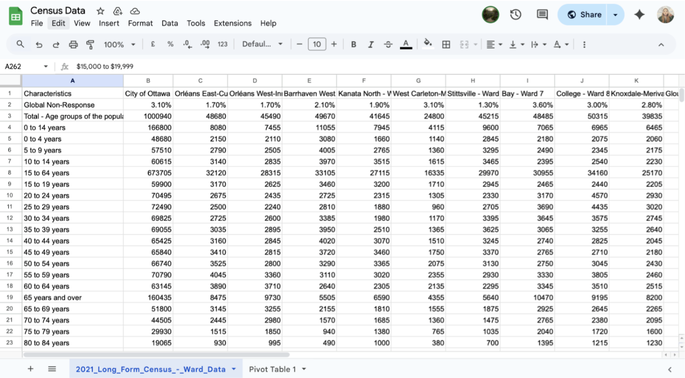
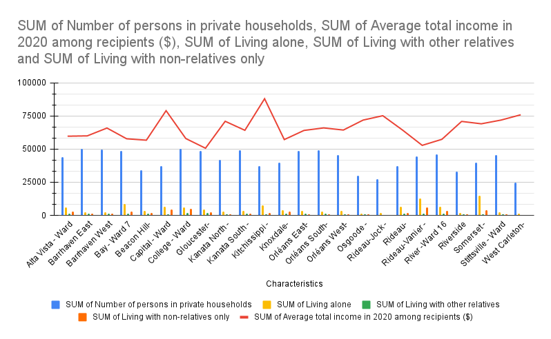

**Date TBD** 
**Course Code & Course Name** 
**MPAD 2002A Introductory Data Storytelling** 
**Student's First Name & Last Name** 
**Gabriel Castillo, Avery O'Donnell, Tina-lise Kostopoulos** 
**Presented to Jean-Sébastien Marier** 

# Exploratory Data Analysis (EDA) & Pitch

# 1. Introduction

For this assignment, we will be analyzing a City of Ottawa dataset of information in the different wards of Ottawa. The dataset was gathered by survey and includes information about the number of people per household, as well as their income and employment status, divided by their ward/living location. It also states the ages of the people. In the first section, we will explain how we got the dataset and the information that we are using. In the following sections, we will be assessing the accuracy of the dataset as well as exploring the data and analyzing it for a potential story.    

Teachers URL: https://raw.githubusercontent.com/jsmarier/files-for-course-assignments/refs/heads/main/2021_Long_Form_Census_-_Ward_Data.csv                                 

Original Dataset: https://open.ottawa.ca/datasets/ottawa::2021-long-form-census-ward-data/explore

## 2. Getting Data

To begin, we imported the dataset into Google Sheets to make it easier to view, clean and analyze. We opened a new Google Sheet, clicked File, Import, Upload, and selected the CSV file from my computer. When prompted,we chose “Insert new sheet(s)” so the data appeared in a new tab while keeping the headers intact. Once the file loaded, the column headings automatically appeared in the first row, followed by 2,602 rows of data.
Below is a screenshot of the dataset immediately after importation:

 

The dataset contains 26 columns and 2,602 rows, each representing demographic information from the City of Ottawa’s census data. Overall, the spreadsheet appears well structured, but there are a few inconsistencies and missing entries. Some ward names differ slightly from those listed on the City of Ottawa’s official website, which may indicate older ward boundaries or formatting errors. There are also a few blank cells where data may have been suppressed for privacy or unavailable at the time of collection. 
Analyzing 3 columns:

Column A (“Characteristics”) contains nominal variables describing each demographic measure (for example, total population, age groups, or median age).

Column B (“City of Ottawa”) holds numerical data summarizing citywide totals or percentages.
Column C through Z represent individual wards, each containing quantitative values for the same characteristics. 

One notable observation is that some wards with similar total populations have very different median ages and household structures. This raises the question: how do demographic characteristics, such as household sizes or age distribution, influence income levels across Ottawa’s wards?

## 3. Understanding Data

### 3.1. VIMO Analysis

Our Census dataset from the City of Ottawa includes a wide range of information. The information types are separated by wards, such as Orleans East/West, Barrhaven, etc. These sections allow for all the data to be presented to the user in an organized, accessible way. The data can range from finance (incomes, rents, etc.) to the number of people per household, who is employed, etc. We decided to focus on the number of people in each household and how it correlates to general household income. The data to figure out the number of people per ward living in houses was found in row 47, and follows along all columns (wards) in the Census. There was also the Average total income in 2019 among recipients ($), which was in row 142. We conducted a detailed VIMO analysis to deeper analyze the data. 

The VIMO analysis covers four main sections: Valid, Invalid, Missing, and Outlier data, in order to identify potential data quality issues and ensure data accuracy before being used in our research and analysis. When it came to performing this analysis, we were able to confirm with our initial sweep that none of the data was missing (every section was filled out), and none of the data was invalid (every section was filled out properly, not with invalid or misplaced data). In terms of data Validity, it was an officially conducted City of Ottawa Census, so we count the data as valid. In terms of outliers, there weren’t any that really stood out in either category. The following images display a more detailed analysis of possible outliers, as well as quartiles, etc. 

Image 1: Individuals Living in Households
 
Image 2: Average Incomes in 2019:
 

### 3.2. Cleaning Data

After the initial analyses of the data, as well as our VIMO analysis, we then moved on to cleaning our data. We used 3 of the methods we had learned in our Media Production and Design: Introductory Data Storytelling. The methods were Google Sheets data-cleaning tools, which we used to get rid of unnecessary/extra spacing, duplicates, data validity tests, etc. We did have some work to do when it came to removing spaces, trimming white spaces, as well as fixing hyphens in the ward names. But, the process was made much easier in Google Sheet’s data cleanup tool set. Aside from the initial cleanup, we then experimented with freezing the rows and columns we needed in order to keep the data accessible to the user. We did this to a smaller dataset of just our isolated variables, and transposed the data. We then froze the top row, which contains the titles of our two categories. (As shown in the following screenshot). Instead, we went into OpenRefine, using Clusters. In OpenRefine, we used facets (text facets, numeric facets), clustering, and used it as well to find extreme highs/lows in the income and household columns, but as mentioned in the previous VIMO analysis, there were no obvious outliers or imposing errors in the data.

Image of frozen rows and isolated data:
 

### 3.3. Exploratory Data Analysis (EDA)

We chose the variables of the people living in private households and whether or not they live alone or with relatives, and compared them to the average income of the ward, because we wanted to see if there might be a correlation between the two. We were thinking that maybe certain jobs that pay well may lead to more families, and vice versa. The particular statistics that stand out are wards 17 and 15, which have the highest average income. The reason we felt that they stood out the most was that while they have the most income, they aren’t leaning towards living with families, but rather living alone or with non-relatives. This is what gets us to our potential story. We think that by exploring these numbers, it might reveal a pattern of affordability and access to resources across the city and how this affects financial stability and quality of life, and also maybe a link to the higher household income, maybe be linked to more people renting out rooms in the household rather than the house as a whole.

Here is the Pivot Table made during the EDA as well as the chart.
 

 

## 4. Potential Story

A potential story could explore how the number of household members across Ottawa’s wards relates to total household income, revealing patterns of inequality, affordability, and access to resources across the city. By comparing households ranging from single-person units to those with five or more members, the story could uncover how family size affects financial stability, housing options, and quality of life. To tell this story effectively, ward-level data from the City of Ottawa’s Open Data portal and the 2021 Statistics Canada Census would be essential to establish clear links between household composition and income levels. Interviews with residents from different household sizes in both higher and lower-income wards would add a personal dimension, illustrating how income disparities shape lived experiences. City councillors could offer insight into how these differences influence local policy decisions, while economists or sociologists from Carleton University could explain the broader social and economic patterns behind the numbers. Organizations such as United Way East Ontario and Ottawa Community Housing could provide frontline perspectives on how income and family size impact access to housing and community services. By combining quantitative data with qualitative interviews, this story would paint a comprehensive picture of how household size continues to shape economic opportunity and inequality across Ottawa’s diverse communities, offering readers both statistical context and human connection. 

## 5. Conclusion

As a group, completing this exploratory data analysis and pitch project was a real learning experience that combined technical work, organization, and collaboration. We started by importing the 2021 Long Form Census Ward Data into Google Sheets, making sure it displayed properly and that we understood the structure of the dataset. Figuring out how to manage all the columns, formatting, and variables took time and teamwork, especially when Sheets didn’t interpret the data the way we expected. The most challenging part of this assignment was definitely working with Google Sheets. Cleaning the data, experimenting with functions, and fixing formatting issues required a lot of trial and error. At the same time, this process was one of the most rewarding parts of the project because it helped us see the dataset transform from something confusing into something organized and meaningful. Once we created pivot tables and exploratory charts, we began identifying patterns that could form the basis of a strong story for our term project. This assignment also showed us where we still have room to grow, especially with using Markdown formatting, GitHub for version control, and more advanced data visualization tools. If we could do it again, we’d plan more time for experimenting with chart options and documenting our steps. Overall, this project strengthened our teamwork, problem-solving, and confidence in working with real-world data.

## 6. References

Bounegru, L., & Gray, J. (Eds.). (2021). *The Data Journalism Handbook 2: Towards A Critical Data Practice*. Amsterdam University Press. [https://ocul-crl.primo.exlibrisgroup.com/permalink/01OCUL_CRL/hgdufh/alma991022890087305153](https://ocul-crl.primo.exlibrisgroup.com/permalink/01OCUL_CRL/hgdufh/alma991022890087305153)
